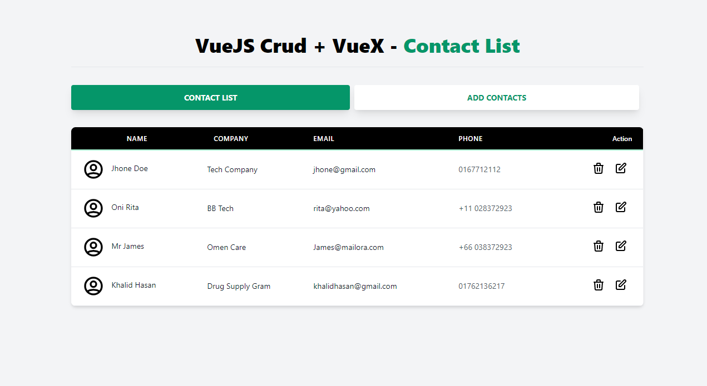
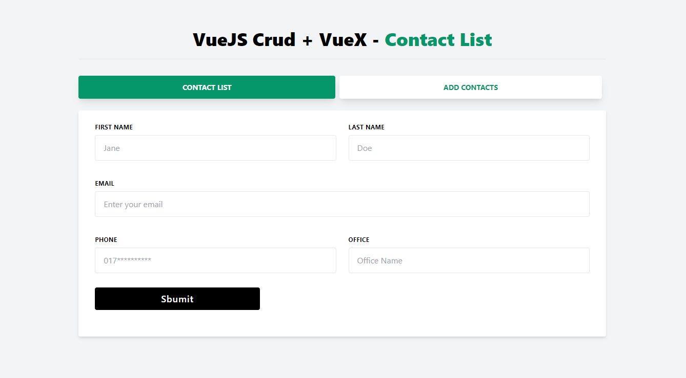

# VueJs CRUD with VueX

A Single Page Contact List application using VueJS , VueRouter & VueX

---

## VueJs CRUD with VueX Demo

Here you can see the screenshot





## Vue-3 CRUD Project Todo List

### Setup Part

- [x] ViteJS
- [x] Tailwind CSS
- [x] VueRouter
- [x] Vuex Setup for Central state Management

### CRUD Part

- [x] Contacts List
- [x] Add Contact
- [x] Edit Contact
- [x] Delete Contact

## Project setup

```bash
git clone https://github.com/mdrathik/vuejs-vuex-crud
cd vuejs-vuex-crud
```

```bash
npm install
npn run dev
```

## Demo Link
